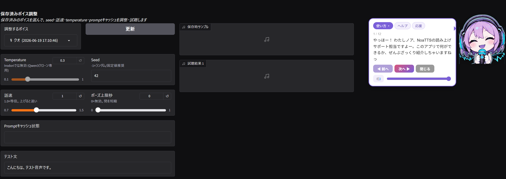
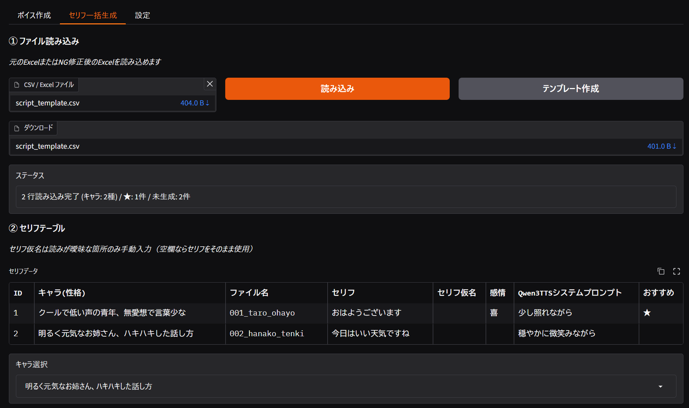
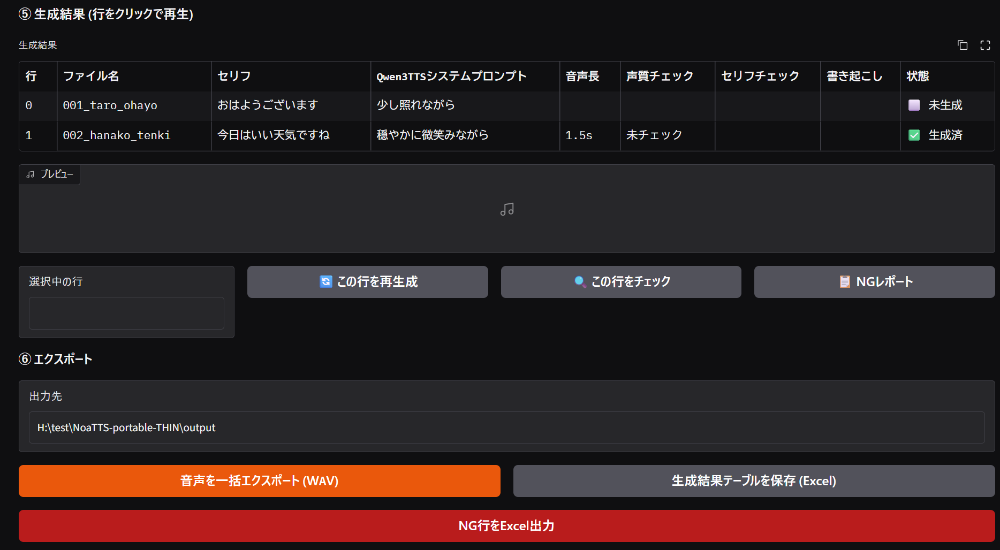
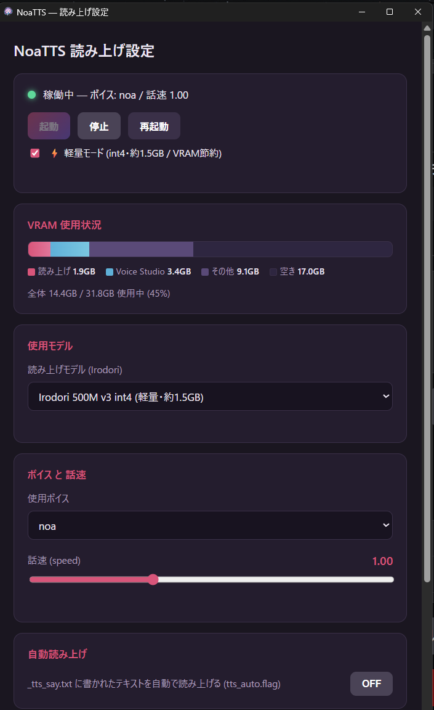
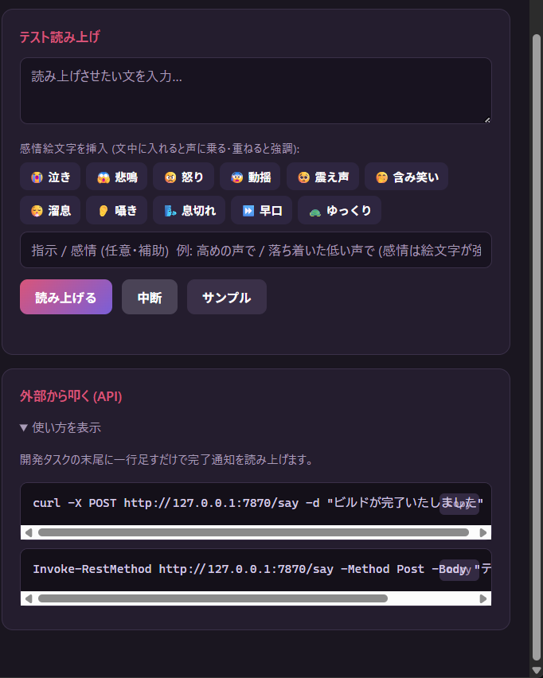

<div align="left">
  
</div>

**日本語** | [English](README.en.md) | [中文](README.zh.md)

# NoaTTS

**好きな声でキャラを喋らせる、ローカル日本語TTS。** テキストを入力すると、作った声で読み上げます。
動作は**あなたのPCの中だけで完結**します（生成した音声は外部に送られません）。
むずかしい設定は、マスコット「ノア」が画面で案内してくれます。

<p align="center"></p>

> ✅ **使えるか30秒チェック**：お使いのPCに **NVIDIA（GeForce / RTX）のグラフィックボード**は付いていますか？
> 付いていれば、たいてい動きます。付いていない（ノートPCの内蔵グラフィックのみ等）と、残念ながら動きません。
> OSは **Windows** 推奨です。**初回の準備のときだけネット接続が必要**（以降はオフラインで動きます）。

## 🔊 まずは聴いてみて（音声サンプル・クリックで再生）

| サンプル | 内容 |
|---|---|
| 🎀 **女性・標準** | [ノアの声](assets/screenshots/samples/01_standard_noa.mp3?raw=1) — 明るく元気なサポート役 |
| 🧭 **男性・標準** | [男性ボイス「man」](assets/screenshots/samples/01_standard_male_man.mp3?raw=1) — 快活で皮肉屋な冒険家風 |
| 😊 **感情（同じ声で！）** | [含み笑い](assets/screenshots/samples/02_emotion_warai.mp3?raw=1)・[怒り](assets/screenshots/samples/03_emotion_okori.mp3?raw=1)・[泣き](assets/screenshots/samples/04_emotion_naki.mp3?raw=1)・[震え声](assets/screenshots/samples/05_emotion_furue.mp3?raw=1) |
| 🎭 **ボイスクローン** | [元の声（Before）](assets/screenshots/samples/clone_before_tsukuyomi.mp3?raw=1) → [複製した声（After）](assets/screenshots/samples/clone_after_1.mp3?raw=1) — 数秒の音声から声を再現 |

> 📌 クローンの参照音声に「つくよみちゃんのサンプルボイス」を使用（ソフト紹介目的の掲載）。
> 　使用素材：つくよみちゃんのサンプルボイス <https://tyc.rei-yumesaki.net/material/voice/sample-voice/>

## できること

### 🎨 好きな声を作れる（3つの方法）
| 方法 | こんな人に | かんたんさ |
|---|---|---|
| **ボイスクローン** | 手持ちの **3〜10秒の音声**から、その声を再現したい | ★★ |
| **カスタムボイス** | 用意された声を選んで微調整したい（Qwen3） | ★★★ かんたん |
| **ボイスデザイン** | 声質を細かく作り込みたい | ★ |

> 作った声は「ボイスカード」として保存・切替できます。
> （商用利用・クローンの注意点は[ライセンス](#ライセンス)を参照）
>
> 🛠 作成を助ける機能：参照音声に BGM が入っていても **BGM除去（Demucs）** でボーカルを抽出／
> 保存前に **5シード比較**で良い声を選び、**喜怒哀楽で試聴**して感情の乗りを確認できます。


> 保存前に seed・話速・temperature を調整して試聴できます。
> 

### 🥺 感情を込められる
文中に **😭😠🥺** などの絵文字を入れると、**声はそのままに感情が乗ります**（Irodori）。
泣き・怒り・含み笑い・囁き・早口など。キャラのセリフに表情をつけられます。

### 📄 台本をまとめて音声化（セリフ一括生成）
**CSV/Excelの台本**を読み込み、キャラごとに声を割り当てて**一気に生成**。
動画・ゲーム・ボイスドラマ・朗読の素材作りに。一本ずつ書き出す手間がいりません。



> 生成後は1行ずつ音声長・声質チェック・書き起こしを確認、NG行だけ再生成できます。
> 

### 🔔 作った声を“常駐の読み上げ係”に
システムトレイに常駐し、テキストを送るだけで読み上げ。作業完了の通知などに便利。
他のアプリやスクリプトからも呼び出せます（**[OpenAI TTS API 互換](#http-api)**・ローカル完結／APIキー不要・くわしい人向け）。



> テスト読み上げ・感情絵文字パレット・API の使い方もこの画面から。
> 

---

## 技術的な特徴

- **2つのTTSエンジン**を切替可能 — [Qwen3-TTS](https://huggingface.co/Qwen) / [Irodori-TTS](https://huggingface.co/Aratako)（同時ロードはしません）
- **VRAM常駐デーモン** — 初回ロード後は待ち時間なしで読み上げ（待機 約1.3GB）
- **⚡軽量モード** — int4軽量モデルでVRAMを節約（読み上げ中も 約1.5GB）。画像生成やゲームなど重いアプリと同居しやすい
- **3つの入力経路** — HTTP API / ファイル監視 / Windows named pipe

---

## 動作環境

> Windows 推奨（開発・検証環境）。named pipe 経路は Windows のみですが、**HTTP API / ファイル監視の経路は Mac / Linux でも動く設計**です（v1.1.0〜・Mac/Linux は未検証）。GPU は NVIDIA + CUDA が前提です（CPU のみでの動作は実用的ではありません）。

**最小スペック**（⚡軽量モードで読み上げするだけ）
→ Windows 10/11 (64bit) ／ NVIDIA GPU **VRAM 4GB**（実使用 約2.0GB）／ RAM 8GB ／ SSD 空き 10GB ／ Python 3.11 + CUDA対応 PyTorch

**推奨スペック**（声の作成も快適・大型の Qwen3 や VoiceDesign も使う）
→ Windows 11 ／ NVIDIA RTX 系 **VRAM 8GB〜**（大型の Qwen3 1.7B を使う場合は 12GB〜）／ RAM 16GB〜 ／ SSD 空き 20GB〜

詳細は下表と、その下の VRAM 注記を参照してください。

| 項目 | 最小 | 推奨 |
|---|---|---|
| OS | Windows 10 / 11 (64bit) | Windows 11 (64bit) |
| GPU | NVIDIA（CUDA対応）／VRAM 4GB〜（⚡軽量モード時） | NVIDIA RTX 系／VRAM 8GB〜（大型の Qwen3 1.7B を使う場合は 12GB〜） |
| 主に使えるエンジン | Irodori 500M 中心 | Qwen3 1.7B・VoiceDesign も快適に切替 |
| メモリ (RAM) | 8GB | 16GB〜 |
| ストレージ | SSD 空き 10GB〜 | SSD 空き 20GB〜 |
| Python | 3.11 | 3.11 |
| PyTorch | CUDA 対応版 | CUDA 12.x 対応版（動作確認: torch 2.11.0+cu128 / CUDA 12.8） |

> ⚠️ **VRAM 実測値**（CUDAコンテキスト込み）— 用途で変わります。
>
> | 使い方 | VRAM |
> |---|---|
> | 読み上げのみ ＋ ⚡軽量モード（int4） | **約2.0GB**（4GB GPUでも快適） |
> | 読み上げのみ ＋ 通常モデル（Irodori 500M） | 約3GB |
> | ＋ Voice Studio（声作成）も並行 | ＋2GBほど（アイドル時は自動退避） |
> | Qwen3-TTS 1.7B（大型エンジン） | 6〜8GB |
>
> エンジン（Qwen3 / Irodori）は**同時にロードされません**（足し算ではありません）。
> CUDA は `setup.bat` が自動検出して合う PyTorch を入れます。

---

## 入手

使い方に合わせて2通り。**ふつうに使いたいだけなら「ポータブル版」が圧倒的にラク**です。

### A. ポータブル版（おすすめ・Python も CUDA も不要）

[**最新リリースをダウンロード**](https://github.com/cutetora/NoaTTS/releases/latest) → **Assets** から落として使います。

| 形式 | 手順 | 向き |
|---|---|---|
| **インストーラ** `NoaTTS-Setup.exe` | ダブルクリックでインストール → デスクトップの `NoaTTS` から起動 | 一番ふつう |
| **ZIP** `NoaTTS-portable-THIN.zip` | 展開 → `NoaTTS.exe` をダブルクリック | 展開して使いたい人 |

- **初回起動だけ**、GPU に合った PyTorch（CUDA 自動検出）と TTS モデルを**自動ダウンロード**します（数GB・数分、ネットが要ります）。2回目以降は即起動。
- **必要なのは NVIDIA GPU＋最新ドライバだけ。** Python や CUDA Toolkit を自分で入れる必要はありません。
- 初回セットアップが終わると、チュートリアル代わりに **Voice Studio（声作成UI）が自動で開きます**。

> 軽量モード(int4)を使う場合のみ、配布物内で `python\python.exe -m pip install -r requirements-lite.txt` を実行してください（任意・Windows）。

### B. ソースから（開発者向け・git + Python を自分で用意）

- **ZIP**: 緑の「Code」→「Download ZIP」で main の最新を取得。
- **git clone**:
  ```bash
  git clone https://github.com/cutetora/NoaTTS.git
  ```

> こちらは下の「セットアップ」に従って Python 3.11 / PyTorch を自分で導入します。`setup.bat`（winget 環境）が git / Python も自動導入できます。

---

## セットアップ（ソースから使う場合）

> 💡 **ワンクリックで使いたいなら上の「A. ポータブル版」**（`NoaTTS-Setup.exe` / ZIP）を使ってください。Python も CUDA も不要です。
>
> 以下は **ソースから動かす開発者向け**の手順です。**Python 3.11 と CUDA 対応 PyTorch を自分で入れる前提**になります（PyTorch は環境の CUDA バージョンに依存するため、ポータブル版では初回起動時に自動導入しています）。

### かんたん: `setup.bat`（CUDA 12.8 / winget 環境向け）

**`setup.bat` をダブルクリック** すると、以下を自動でやります:

1. `git` / `Python 3.11` を winget で導入（無い場合）
2. `venv`（仮想環境）を作成
3. CUDA 12.8 版 PyTorch を導入
4. `requirements.txt` の依存を導入
5. **TTSモデルを事前ダウンロード**（数GB・数分。ここで落とすので初回起動が速い）

> ⚠️ `setup.bat` は **NVIDIA GPU を自動チェックし、GPU の CUDA バージョンも自動検出**して合う PyTorch を導入します（cu128 / cu124 / cu121 / cu118 を自動選択）。winget があれば git / Python も自動導入。winget が無い環境では、git / Python を手動で入れてから実行してください。

終わったら `run_tray.bat`（または `NoaTTS.exe`）で起動します。`venv` があれば各 bat / exe は自動でそれを使います。モデルは setup 時に取得済みなので、起動後すぐ使えます。

### 手動セットアップ

Python 3.11 を推奨。**先に PyTorch を入れてから** 依存をインストールします。

1. **Python 3.11** を導入（`py -3.11` で呼べる状態にする）。
2. **CUDA 対応の PyTorch** を導入（環境の CUDA バージョンに合わせる）。
   <https://pytorch.org/get-started/locally/> から `torch` と `torchaudio` を入れる
   （動作確認: torch 2.11.0+cu128 / CUDA 12.8）。
3. 残りの依存をインストール（TTS エンジンを GitHub から取得するため **git が必要**）。

```bash
pip install -r requirements.txt
```

4. （任意）モデルを事前ダウンロードしておくと初回起動が速くなります。省略した場合は初回起動時に自動取得されます。

```bash
python download_models.py
```

---

## 起動方法

目的に応じて4通り。普段使いは **`NoaTTS.exe` をダブルクリック** が一番ラク。

| やりたいこと | 起動方法 | 説明 |
|---|---|---|
| 普段使い（おすすめ） | **`NoaTTS.exe` をダブルクリック** | アイコン付きで黒窓を出さずにトレイ常駐を起動するランチャー（中身は `run_tray.bat` と同じくトレイ起動） |
| トレイ常駐（bat 版） | `run_tray.bat` | トレイアイコン + Web UI + デーモン管理をまとめて |
| 読み上げだけ使う | `python noa_tts_daemon.py` | デーモン単体。HTTP API(:7870)・ファイル監視・pipe が立つ |
| ボイス作成 Web UI 単体 | `run.bat` | Gradio の Voice Studio(:7860) |

トレイ常駐後の操作:

- **トレイアイコンをダブルクリック** → Voice Studio（Web UI）を開く
- **トレイアイコンを右クリック** → 読み上げ設定・ボイス選択・モデル退避などのメニュー

デーモンのボイスは `--voice <名前>` で指定（既定は `noa`）。同梱ボイスは `noa` のみで、
ほかのボイスは Web UI から自分で作成します。

```bash
python noa_tts_daemon.py --voice noa
```

> `NoaTTS.exe` は `noa_launcher.py` を PyInstaller でビルドしたものです。自分で作り直す場合:
> ```bash
> py -3.11 -m PyInstaller --onefile --noconsole --icon assets/noa.ico --name NoaTTS noa_launcher.py
> ```

---

## HTTP API

> 🧩 **開発者向け：** **OpenAI TTS API 互換**（`/v1/audio/speech`）。既存の OpenAI-TTS クライアントの**ベースURLを差し替えるだけ**で使えます。**完全ローカル動作・APIキー不要・従量課金なし・音声は外部に送られません**。

デーモン起動中、`http://127.0.0.1:7870/` をブラウザで開くとコントロールパネルが出ます。

| メソッド | パス | 説明 |
|---|---|---|
| `POST` | `/say` | 本文（プレーン or JSON）を読み上げ。トグルOFFでも必ず読む |
| `POST` | `/say_wav` | 合成WAVを返す（再生しない）。クライアント側で再生したい時に |
| `POST` | `/v1/audio/speech` | **OpenAI TTS API 互換**。既存の OpenAI-TTS クライアントから差し替えで使える |
| `POST` | `/stop` | 読み上げを中断 |
| `POST` | `/voice` | ボイス切替（`{"name": "..."}`） |
| `POST` | `/speed` | 話速変更（`{"speed": 1.0}`） |
| `POST` | `/gap` | 文間の無音（秒）。`gap.txt` に永続化 |
| `POST` | `/nosplit` | この文字数以下は文分割しない。`nosplit.txt` に永続化 |
| `POST` | `/firstcut` | 1文目の早切り目標文字数（0で無効）。`firstcut.txt` に永続化 |
| `POST` | `/pause` | 音声内ポーズ上限（秒、0で無加工）。`pause.txt` に永続化 |
| `GET`·`POST` | `/model` | 使用モデルの照会・切替 |
| `GET`·`POST` | `/cache` | 音声キャッシュの照会・ON/OFF・クリア（`{"action":"clear"}`） |
| `POST` | `/toggle` | 自動読み上げ（`tts_auto.flag`）の切替 |
| `GET`  | `/vram` | VRAM 使用状況（全体／NoaTTS／空き） |
| `POST` | `/quit` | デーモンを終了 |
| `GET`  | `/health` | 稼働状態（ボイス・話速・各調整値・モデル等のJSON） |
| `GET`  | `/voices` | ボイス一覧 |

> 🔧 **出力フォーマット**：`/say_wav` が返す WAV は **24 kHz / モノラル / 16-bit PCM** です。`/v1/audio/speech` は `response_format` で `wav` / `mp3` / `flac` / `ogg` / `opus` / `aac` / `pcm` を選べます（いずれも 24 kHz・モノラル系）。
> リクエストのテキスト項目は、**独自APIは `text`**、**OpenAI互換は `input`** です（`Authorization` ヘッダは不要・送っても無視されます）。

`/say` の JSON では `text` のほか、`volume`（0.0〜1.0）・`caption`（その読み上げに限り感情を上書き、Irodoriクローン用）・`cache`（true/false、その回だけキャッシュ利用を上書き）を指定できます。

> 💾 **音声キャッシュ**：同じ「テキスト＋ボイス＋話速＋感情」の組み合わせは、合成済み WAV を再利用して即座に返します。`tts_cache.flag` または `POST /cache {"enabled":true}` で有効化。

### OpenAI TTS API 互換（`/v1/audio/speech`）

既存の OpenAI Text-to-Speech クライアントから、ベースURLを `http://127.0.0.1:7870/v1` に向けるだけで NoaTTS に差し替えできます。`voice` には NoaTTS のボイスカード名、`response_format` は **`wav` / `mp3` / `flac` / `ogg` / `opus` / `aac` / `pcm`** に対応（環境にエンコーダが無い形式は `wav` にフォールバック）。

```bash
curl http://127.0.0.1:7870/v1/audio/speech \
  -H "Content-Type: application/json" \
  -d '{"input":"こんにちは、ノアです","voice":"noa","response_format":"wav"}' --output out.wav
```

例:

```bash
# プレーンテキスト
curl -X POST http://127.0.0.1:7870/say -d "テストです。聞こえていますか？"

# JSON（音量・感情つき）
curl -X POST http://127.0.0.1:7870/say -H "Content-Type: application/json" \
  -d "{\"text\": \"おかえりなさい\", \"volume\": 0.8}"
```

絵文字・マークダウン記号・コードブロックは送信時に自動除去されます（感情絵文字は残ります）。

### 自動読み上げ（ファイル監視）

`tts_auto.flag` ファイルが存在する間、`_tts_say.txt` の内容が書き換わると自動で読み上げます。
外部スクリプトから「テキストをファイルに書くだけ」で読み上げさせたい場合に使います。フラグが無ければ無視されます（HTTP / pipe はフラグに関係なく常に読み上げ）。

---

## 感情絵文字（Irodori）

Irodori エンジンでは、読み上げテキストに感情絵文字を埋め込むと、**声（参照音声）はそのままに感情だけ**が乗ります。同じ絵文字を重ねると効果が強まります（実測: 😭1個で音声長 +30%、😭×3で +130%）。通常の装飾絵文字は除去されますが、これらの感情絵文字は残して解釈されます。

| 絵文字 | 効果 | 絵文字 | 効果 |
|---|---|---|---|
| 😭 | 泣き | 🤭 | 含み笑い |
| 😱 | 悲鳴 | 😮‍💨 | 溜息・吐息 |
| 😠 | 怒り | 👂 | 囁き |
| 😰 | 動揺 | 🌬️ | 息切れ |
| 🥺 | 震え声 | ⏩ / 🐢 | 早口 / ゆっくり |

Web UI の絵文字パレットからも挿入できます。

---

## セリフ一括生成

台本（CSV / Excel）を読み込み、登場キャラごとにボイスを割り当てて、まとめて音声ファイルを生成できます（動画・ゲームのセリフ作りなどに）。キャラ⇔ボイスの割り当ては **プリセット**として `presets/<名前>.json` に保存・呼び出しできます。Web UI の「セリフ一括生成」タブから操作します。

サンプル台本（記入例つき）: [sample_script.xlsx](sample_script.xlsx)（Excel・推奨） / [sample_script.csv](sample_script.csv)（CSV）。どちらも Google スプレッドシートでも開けます。「テンプレート作成」ボタンを押すと、このサンプルがその場でセリフテーブルに読み込まれ、編集してそのまま「上書き保存」できます（ダウンロードも可）。

台本の列（順不同・見出し名で自動認識）:

| 列 | 必須 | 説明 |
|---|---|---|
| `ID` | ○ | 通し番号。`■` で始めると区切り見出し行になり生成対象から外れる |
| `キャラ(性格)` | ○ | 声の性格を文章で。**同じ文字列**のキャラには同じボイスが割り当たる |
| `ファイル名` | ○ | 出力WAV名。半角英数と `_ - .` 推奨（全角・記号は除去される） |
| `セリフ` | ○ | 読み上げる本文 |
| `セリフ仮名` | | 読みが不安な語だけ仮名で上書き（任意） |
| `感情` | | 喜 / 怒 / 哀 / 楽 など（任意） |
| `Qwen3TTSシステムプロンプト` | | 話し方・口調の指示（任意） |
| `おすすめ` | | `★` を入れると採用候補マーク。読み込み時に件数集計される |

### 生成後の自動チェック（おまけ機能）

生成した音声を **Whisper でセリフ照合**し、**声の性別（F0）** もチェックします。NG だった行は
指示を調整して**最大3回まで自動リトライ**。`★` 行のみ生成・1行が長すぎる場合の ⚠️ 警告・
行単位の再生成・NGレポート（`ng_report.txt`／NG行のExcel出力）にも対応します。

> ⚠️ **このチェックは完全ではありません。** Whisper の聞き取りや F0 判定には誤りもあり、
> 正しい音声を NG と誤判定したり、その逆もあります。**あくまで目安**として使い、
> 最終的な採否は耳で確認してください。

---

## ボイスカード

`voices/<名前>/` にボイスごとの `config.json`（話者・seed・参照音声・話速など）と参照音声を置きます。Web UI（`run.bat`）から作成・編集できます。

> ⚠️ **同梱ボイスについて**: このリポジトリに同梱されるボイスは `noa`（自作）のみです。あなたがクローン作成した（参照音声に第三者の録音を使った）ボイスを追加して再配布する場合は、各自で権利関係を確認してください。

---

## フォルダ構成（開発者向け）

コードは機能ごとにパッケージへ分類しています。エントリポイントと設定パス基準（`config.py`）はルート直下のままです。

```
engine/   TTS合成コア（tts_engine, irodori_engine, engine_control, audio_utils, models_catalog, emotion_emoji, text_utils）
voice/    ボイス管理（voice_manager, voice_creation, preset_manager）
ui/       Voice Studio のUI部品（mascot, ui_voice_create/）
daemon/   読み上げデーモン
batch/    セリフ一括生成
conf/     設定・読み辞書（settings.json※ / settings.default.json / reading_dict.json）
tests/    テスト
assets/ docs/ voices/ presets/   素材・データ
```

ルート直下の `.py` はエントリポイント（`app.py` / `tray.py` / `noa_tts_daemon.py` / `noa_launcher.py` / `tts_api_window.py` / `webview_window.py` / `download_models.py`）と、全体が参照する基盤（`config.py`）です。`bat`・`NoaTTS.exe` はこれらをファイル名で起動するため、移動していません。

> ※ `conf/settings.json` は初回起動時に `conf/settings.default.json` からコピー生成され、以後ユーザー設定で書き換わるため git 管理外です。

---

## 更新履歴

変更点は [CHANGELOG.md](CHANGELOG.md) を参照してください。最新版は **v1.2.0**（ワンクリック配布・ポータブル版）。

---

## ライセンス

本アプリのコードは [MIT License](LICENSE) で配布します。
使用する TTS モデルや同梱ボイスのライセンスは、各提供元の条項に従います。

- **Irodori-TTS**（既定エンジン） — コード・モデルともに **MIT ライセンス**で、**商用利用が可能**です（[コード](https://github.com/Aratako/Irodori-TTS) / [モデルカード](https://huggingface.co/Aratako/Irodori-TTS-500M-v3)）。
  ただし、**本人の同意なく実在の人物（声優・有名人など）の声をクローンすること、ディープフェイクや誤情報の作成は禁止**されています。
- **Qwen3-TTS** — 各提供元（[Qwen3-TTS-streaming](https://github.com/dffdeeq/Qwen3-TTS-streaming) / [Qwen 公式](https://huggingface.co/Qwen)）のライセンスをご確認ください。

> ⚠️ 最終的な利用可否（商用を含む）は、使用するモデル・参照したクローン元の音声・各依存コンポーネントのライセンスを **ご自身で確認のうえ判断してください**。本プロジェクトはこれらの利用結果について責任を負いません。
