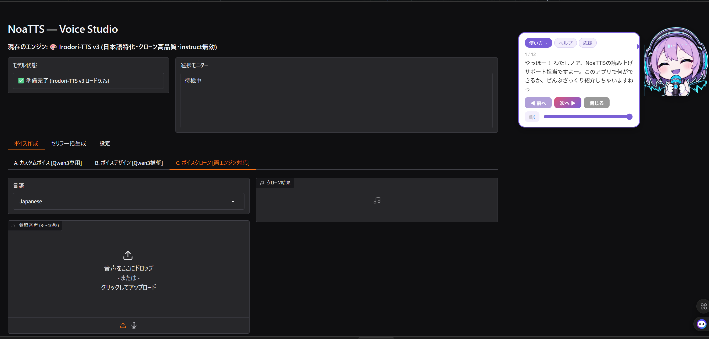

<div align="left">
  
</div>

[日本語](README.md) | [English](README.en.md) | **中文**

# NoaTTS

**用你喜欢的声音让角色开口说话的本地日语 TTS。** 输入文本，就能用你制作的声音读出来。
**无需联网，仅在你自己的电脑上运行**（需要 Windows / NVIDIA 显卡）。
复杂的设置，会由吉祥物「诺亚（Noa）」在画面上为你引导。

<p align="center"></p>

## 能做什么

### 🎨 可以制作喜欢的声音（3 种方式）
| 方式 | 适合这样的人 | 简易度 |
|---|---|---|
| **语音克隆** | 想用手头 **3〜10 秒的音频** 来重现那个声音 | ★★ |
| **自定义音色** | 想从预设的声音中挑选并微调（Qwen3） | ★★★ 简单 |
| **音色设计** | 想细致地打磨声音的质感 | ★ |

> 制作好的声音可作为「声卡（Voice Card）」保存与切换。
> （商用与克隆的注意事项请参阅[许可证](#许可证)）

### 🥺 可以注入情感
在句子中加入 **😭😠🥺** 等表情符号，**声音保持不变，只叠加情感**（Irodori）。
哭泣、愤怒、含笑、低语、快速说话等。可以为角色台词添加表情。

### 📄 批量将剧本转为音频（台词批量生成）
读取 **CSV/Excel 剧本**，为每个角色分配声音，**一口气批量生成**。
适合制作视频、游戏、有声剧、朗读等素材。无需一条条逐个导出。

### 🔔 让制作好的声音成为「常驻朗读员」
常驻系统托盘，只要发送文本就会读出来。用于提示作业完成等通知很方便。
也可以从其他应用或脚本调用（**[兼容 OpenAI TTS API](#http-api)**、完全本地运行／无需 API 密钥／面向进阶用户）。

<!-- TODO(截图): 请把图片放到 assets/screenshots/ 下，并在各章节中以
      的形式插入。
     推荐: voice-studio.png / batch-generate.png / tts-settings.png -->

### 🔊 音声样本（点击即可播放・下载）

| 样本 | 内容 |
|---|---|
| 🎀 **女声・标准** | [诺亚的声音](assets/screenshots/samples/01_standard_noa.mp3?raw=1) — 明朗活泼的辅助角色 |
| 🧭 **男声・标准** | [Nathan 的声音](assets/screenshots/samples/01_standard_male_nathan.mp3?raw=1) — 爽朗而爱挖苦的冒险家风格 |
| 😊 **情感（用同一声音）** | [含笑](assets/screenshots/samples/02_emotion_warai.mp3?raw=1)・[愤怒](assets/screenshots/samples/03_emotion_okori.mp3?raw=1)・[哭泣](assets/screenshots/samples/04_emotion_naki.mp3?raw=1)・[颤抖声](assets/screenshots/samples/05_emotion_furue.mp3?raw=1) |
| 🎭 **语音克隆** | [原始声音（Before）](assets/screenshots/samples/clone_before_tsukuyomi.mp3?raw=1) → [复制的声音（After）](assets/screenshots/samples/clone_after_1.mp3?raw=1) |

> 📌 克隆的参考音频使用了「月读酱（Tsukuyomi-chan）的样本语音」（以介绍软件为目的刊载）。
> 　使用素材：月读酱的样本语音 <https://tyc.rei-yumesaki.net/material/voice/sample-voice/>

---

## 技术特点

- **两种 TTS 引擎**可切换 — [Qwen3-TTS](https://huggingface.co/Qwen) / [Irodori-TTS](https://huggingface.co/Aratako)（不会同时加载）
- **VRAM 常驻守护进程** — 首次加载后即可零等待读出（待机约 1.3GB）
- **⚡轻量模式** — 用 int4 轻量模型节省 VRAM（读出过程中也约 1.5GB）。容易与图像生成、游戏等吃资源的应用共存
- **三条输入通道** — HTTP API / 文件监视 / Windows 命名管道（named pipe）

---

## 运行环境

> 推荐 Windows（开发与验证环境）。命名管道（named pipe）通道仅限 Windows，但 **HTTP API / 文件监视通道在 Mac / Linux 上也能运行（设计如此）**（v1.1.0〜・Mac/Linux 未经验证）。GPU 以 NVIDIA + CUDA 为前提（仅靠 CPU 运行并不实用）。

**最低配置**（仅用 ⚡轻量模式读出）
→ Windows 10/11 (64bit) ／ NVIDIA GPU **VRAM 4GB**（实际占用约 2.0GB）／ RAM 8GB ／ SSD 剩余 10GB ／ Python 3.11 + 支持 CUDA 的 PyTorch

**推荐配置**（声音制作也很流畅・同时使用大型的 Qwen3 与 VoiceDesign）
→ Windows 11 ／ NVIDIA RTX 系 **VRAM 8GB〜**（使用大型的 Qwen3 1.7B 时需 12GB〜）／ RAM 16GB〜 ／ SSD 剩余 20GB〜

详情请参阅下表，以及其下方的 VRAM 注记。

| 项目 | 最低 | 推荐 |
|---|---|---|
| OS | Windows 10 / 11 (64bit) | Windows 11 (64bit) |
| GPU | NVIDIA（支持 CUDA）／VRAM 4GB〜（⚡轻量模式时） | NVIDIA RTX 系／VRAM 8GB〜（使用大型的 Qwen3 1.7B 时需 12GB〜） |
| 主要可用引擎 | 以 Irodori 500M 为主 | Qwen3 1.7B・VoiceDesign 也能流畅切换 |
| 内存 (RAM) | 8GB | 16GB〜 |
| 存储 | SSD 剩余 10GB〜 | SSD 剩余 20GB〜 |
| Python | 3.11 | 3.11 |
| PyTorch | 支持 CUDA 的版本 | 支持 CUDA 12.x 的版本（实测: torch 2.11.0+cu128 / CUDA 12.8） |

> ⚠️ **VRAM 实测值**（含 CUDA 上下文）— 会随用途变化。
>
> | 用法 | VRAM |
> |---|---|
> | 仅读出 ＋ ⚡轻量模式（int4） | **约 2.0GB**（4GB 显卡也很流畅） |
> | 仅读出 ＋ 普通模型（Irodori 500M） | 约 3GB |
> | ＋ 同时并行 Voice Studio（声音制作） | ＋约 2GB（空闲时自动退避） |
> | Qwen3-TTS 1.7B（大型引擎） | 6〜8GB |
>
> 引擎（Qwen3 / Irodori）**不会同时加载**（不是相加关系）。
> CUDA 由 `setup.bat` 自动检测并安装匹配的 PyTorch。

---

## 获取方式

按使用需求分两种。**如果只是想正常使用，「便携版」轻松得多。**

### A. 便携版（推荐・无需 Python 与 CUDA）

[**下载最新发行版**](https://github.com/cutetora/NoaTTS/releases/latest) → 从 **Assets** 下载使用。

| 形式 | 步骤 | 适合 |
|---|---|---|
| **安装程序** `NoaTTS-Setup.exe` | 双击安装 → 从桌面的 `NoaTTS` 启动 | 最常见 |
| **ZIP** `NoaTTS-portable-THIN.zip` | 解压 → 双击 `NoaTTS.exe` | 想解压后直接使用的人 |

- **仅首次启动时**，会**自动下载**适配你 GPU 的 PyTorch（自动检测 CUDA）和 TTS 模型（数 GB・数分钟，需要联网）。第二次起即可立即启动。
- **只需要 NVIDIA GPU ＋ 最新驱动即可。** 无需自己安装 Python 或 CUDA Toolkit。
- 首次设置完成后，会**自动打开 Voice Studio（声音制作 UI）**作为教程引导。

> 仅在使用轻量模式 (int4) 时，请在发行包内执行 `python\python.exe -m pip install -r requirements-lite.txt`（可选・Windows）。

### B. 从源码（面向开发者・需自备 git + Python）

- **ZIP**: 通过绿色「Code」→「Download ZIP」获取 main 的最新版。
- **git clone**:
  ```bash
  git clone https://github.com/cutetora/NoaTTS.git
  ```

> 此方式需按下方「安装设置」自行安装 Python 3.11 / PyTorch。`setup.bat`（winget 环境）也能自动安装 git / Python。

---

## 安装设置（从源码使用时）

> 💡 **如果想一键使用，请用上面的「A. 便携版」**（`NoaTTS-Setup.exe` / ZIP）。无需 Python 与 CUDA。
>
> 以下是**面向从源码运行的开发者**的步骤。**前提是自行安装 Python 3.11 与支持 CUDA 的 PyTorch**（由于 PyTorch 依赖于环境的 CUDA 版本，便携版会在首次启动时自动安装）。

### 简单: `setup.bat`（面向 CUDA 12.8 / winget 环境）

**双击 `setup.bat`** 会自动完成以下事项:

1. 用 winget 安装 `git` / `Python 3.11`（若没有）
2. 创建 `venv`（虚拟环境）
3. 安装 CUDA 12.8 版的 PyTorch
4. 安装 `requirements.txt` 中的依赖
5. **预先下载 TTS 模型**（数 GB・数分钟。在此处下载，使首次启动更快）

> ⚠️ `setup.bat` 会**自动检查 NVIDIA GPU，并自动检测 GPU 的 CUDA 版本**，安装匹配的 PyTorch（在 cu128 / cu124 / cu121 / cu118 中自动选择）。若有 winget，也会自动安装 git / Python。在没有 winget 的环境中，请先手动安装 git / Python 后再执行。

完成后用 `run_tray.bat`（或 `NoaTTS.exe`）启动。若存在 `venv`，各 bat / exe 会自动使用它。模型在 setup 时已获取，启动后即可使用。

### 手动安装设置

推荐 Python 3.11。**先安装 PyTorch，再**安装依赖。

1. 安装 **Python 3.11**（使其可通过 `py -3.11` 调用）。
2. 安装 **支持 CUDA 的 PyTorch**（与环境的 CUDA 版本匹配）。
   从 <https://pytorch.org/get-started/locally/> 安装 `torch` 与 `torchaudio`
   （实测: torch 2.11.0+cu128 / CUDA 12.8）。
3. 安装其余依赖（由于要从 GitHub 获取 TTS 引擎，**需要 git**）。

```bash
pip install -r requirements.txt
```

4. （可选）预先下载模型可使首次启动更快。若省略，则会在首次启动时自动获取。

```bash
python download_models.py
```

---

## 启动方法

根据用途分 4 种。日常使用 **双击 `NoaTTS.exe`** 最轻松。

| 想做的事 | 启动方法 | 说明 |
|---|---|---|
| 日常使用（推荐） | **双击 `NoaTTS.exe`** | 带图标、不弹黑窗即可启动托盘常驻的启动器（内部与 `run_tray.bat` 同样是托盘启动） |
| 托盘常驻（bat 版） | `run_tray.bat` | 一并启动托盘图标 + Web UI + 守护进程管理 |
| 仅使用读出 | `python noa_tts_daemon.py` | 守护进程单体。会启动 HTTP API(:7870)・文件监视・pipe |
| 仅声音制作 Web UI | `run.bat` | Gradio 的 Voice Studio(:7860) |

托盘常驻后的操作:

- **双击托盘图标** → 打开 Voice Studio（Web UI）
- **右键点击托盘图标** → 读出设置・声音选择・模型退避等菜单

守护进程的声音用 `--voice <名称>` 指定（默认是 `noa`）。随附的声音仅有 `noa`，
其他声音请从 Web UI 自行制作。

```bash
python noa_tts_daemon.py --voice noa
```

> `NoaTTS.exe` 是用 PyInstaller 构建 `noa_launcher.py` 而成。若要自行重新构建:
> ```bash
> py -3.11 -m PyInstaller --onefile --noconsole --icon assets/noa.ico --name NoaTTS noa_launcher.py
> ```

---

## HTTP API

> 🧩 **面向开发者：** **兼容 OpenAI TTS API**（`/v1/audio/speech`）。**只需替换**现有 OpenAI-TTS 客户端的**基础 URL** 即可使用。**完全本地运行・无需 API 密钥・无按量计费・音频不会发送到外部。**

守护进程运行中，在浏览器打开 `http://127.0.0.1:7870/` 会出现控制面板。

| 方法 | 路径 | 说明 |
|---|---|---|
| `POST` | `/say` | 读出正文（纯文本 or JSON）。即使开关为 OFF 也必定读出 |
| `POST` | `/say_wav` | 返回合成的 WAV（不播放）。想在客户端侧播放时使用 |
| `POST` | `/v1/audio/speech` | **兼容 OpenAI TTS API**。可从现有 OpenAI-TTS 客户端替换使用 |
| `POST` | `/stop` | 中断读出 |
| `POST` | `/voice` | 切换声音（`{"name": "..."}`） |
| `POST` | `/speed` | 修改语速（`{"speed": 1.0}`） |
| `POST` | `/gap` | 句间静音（秒）。持久化到 `gap.txt` |
| `POST` | `/nosplit` | 字数不超过此值则不进行分句。持久化到 `nosplit.txt` |
| `POST` | `/firstcut` | 第 1 句的提前截断目标字数（0 为禁用）。持久化到 `firstcut.txt` |
| `POST` | `/pause` | 音频内停顿上限（秒，0 为不加工）。持久化到 `pause.txt` |
| `POST` | `/quit` | 结束守护进程 |
| `GET`  | `/health` | 运行状态（声音・语速・各调整值・模型等的 JSON） |
| `GET`  | `/voices` | 声音一览 |

`/say` 的 JSON 中，除 `text` 外，还可指定 `volume`（0.0〜1.0）与 `caption`（仅对该次读出覆盖情感，用于 Irodori 克隆）。

### 兼容 OpenAI TTS API（`/v1/audio/speech`）

从现有的 OpenAI Text-to-Speech 客户端，只需把基础 URL 指向 `http://127.0.0.1:7870/v1` 即可替换为 NoaTTS。`voice` 填写 NoaTTS 的声卡名称，`response_format` 支持 **`wav` / `mp3` / `flac` / `ogg` / `opus` / `aac` / `pcm`**（环境中没有对应编码器的格式会回退为 `wav`）。

```bash
curl http://127.0.0.1:7870/v1/audio/speech \
  -H "Content-Type: application/json" \
  -d '{"input":"こんにちは、ノアです","voice":"noa","response_format":"wav"}' --output out.wav
```

示例:

```bash
# 纯文本
curl -X POST http://127.0.0.1:7870/say -d "テストです。聞こえていますか？"

# JSON（带音量・情感）
curl -X POST http://127.0.0.1:7870/say -H "Content-Type: application/json" \
  -d "{\"text\": \"おかえりなさい\", \"volume\": 0.8}"
```

表情符号、Markdown 符号、代码块在发送时会被自动移除（情感表情符号会保留）。

### 自动读出（文件监视）

在 `tts_auto.flag` 文件存在期间，只要 `_tts_say.txt` 的内容发生改写，就会自动读出。
适合从外部脚本「只需把文本写入文件」即可触发读出的场景。若没有该标志则会被忽略（HTTP / pipe 与标志无关，始终读出）。

---

## 情感表情符号（Irodori）

在 Irodori 引擎下，向读出文本中嵌入情感表情符号，可**在声音（参考音频）保持不变的前提下，只叠加情感**。重复相同的表情符号会增强效果（实测: 😭1 个使音频时长 +30%，😭×3 则 +130%）。普通的装饰性表情符号会被移除，但这些情感表情符号会被保留并解读。

| 表情符号 | 效果 | 表情符号 | 效果 |
|---|---|---|---|
| 😭 | 哭泣 | 🤭 | 含笑 |
| 😱 | 尖叫 | 😮‍💨 | 叹息・吐气 |
| 😠 | 愤怒 | 👂 | 低语 |
| 😰 | 慌乱 | 🌬️ | 喘不上气 |
| 🥺 | 颤抖声 | ⏩ / 🐢 | 快速 / 缓慢 |

也可从 Web UI 的表情符号面板插入。

---

## 台词批量生成

可读取剧本（CSV / Excel），为每个登场角色分配声音，批量生成音频文件（用于制作视频、游戏的台词等）。角色⇔声音的分配可作为 **预设** 保存到 `presets/<名称>.json` 并调用。从 Web UI 的「台词批量生成」标签页操作。

样本剧本（含填写示例）: [sample_script.xlsx](sample_script.xlsx)（Excel・推荐） / [sample_script.csv](sample_script.csv)（CSV）。两者都可在 Google 表格中打开。按下「创建模板」按钮，该样本会当场加载到台词表格中，可编辑后直接「覆盖保存」（也可下载）。

剧本的列（顺序不限・按表头名自动识别）:

| 列 | 必填 | 说明 |
|---|---|---|
| `ID` | ○ | 流水编号。以 `■` 开头则成为分隔标题行，排除在生成对象之外 |
| `キャラ(性格)`（角色（性格）） | ○ | 用文字描述声音的性格。**相同字符串**的角色会被分配相同的声音 |
| `ファイル名`（文件名） | ○ | 输出 WAV 名。推荐半角英数与 `_ - .`（全角・符号会被移除） |
| `セリフ`（台词） | ○ | 要读出的正文 |
| `セリフ仮名`（台词假名） | | 仅对读音不确定的词用假名覆盖（可选） |
| `感情`（情感） | | 喜 / 怒 / 哀 / 楽 等（可选） |
| `Qwen3TTSシステムプロンプト`（Qwen3TTS 系统提示词） | | 说话方式・口吻的指示（可选） |
| `おすすめ`（推荐） | | 填入 `★` 作为采用候选标记。加载时会统计件数 |

---

## 声卡（Voice Card）

在 `voices/<名称>/` 下放置每个声音的 `config.json`（说话者・seed・参考音频・语速等）与参考音频。可从 Web UI（`run.bat`）创建与编辑。

> ⚠️ **关于随附声音**: 本仓库随附的声音仅有 `noa`（自制）。若你要追加并再分发你克隆制作的（参考音频使用了第三方录音的）声音，请各自确认权利关系。

---

## 文件夹结构（面向开发者）

代码按功能分类到各个包中。入口点与设置路径基准（`config.py`）仍保留在根目录下。

```
engine/   TTS 合成核心（tts_engine, irodori_engine, engine_control, audio_utils, models_catalog, emotion_emoji, text_utils）
voice/    声音管理（voice_manager, voice_creation, preset_manager）
ui/       Voice Studio 的 UI 部件（mascot, ui_voice_create/）
daemon/   读出守护进程
batch/    台词批量生成
conf/     设置・读音词典（settings.json※ / settings.default.json / reading_dict.json）
tests/    测试
assets/ docs/ voices/ presets/   素材・数据
```

根目录下的 `.py` 是入口点（`app.py` / `tray.py` / `noa_tts_daemon.py` / `noa_launcher.py` / `tts_api_window.py` / `webview_window.py` / `download_models.py`），以及全局引用的基础设施（`config.py`）。`bat`・`NoaTTS.exe` 按文件名启动这些文件，因此未移动。

> ※ `conf/settings.json` 会在首次启动时从 `conf/settings.default.json` 复制生成，此后随用户设置被改写，因此不纳入 git 管理。

---

## 更新历史

变更点请参阅 [CHANGELOG.md](CHANGELOG.md)。最新版为 **v1.2.0**（一键分发・便携版）。

---

## 许可证

本应用的代码以 [MIT License](LICENSE) 分发。
所使用的 TTS 模型及随附声音的许可证，遵循各提供方的条款。

- **Irodori-TTS**（默认引擎） — 代码与模型均为 **MIT 许可证**，**可商用**（[代码](https://github.com/Aratako/Irodori-TTS) / [模型卡](https://huggingface.co/Aratako/Irodori-TTS-500M-v3)）。
  但**禁止未经本人同意克隆现实人物（声优・名人等）的声音，以及制作深度伪造（deepfake）或虚假信息**。
- **Qwen3-TTS** — 请确认各提供方（[Qwen3-TTS-streaming](https://github.com/dffdeeq/Qwen3-TTS-streaming) / [Qwen 官方](https://huggingface.co/Qwen)）的许可证。

> ⚠️ 最终能否使用（含商用），请**根据所使用的模型、所参考的克隆源音频、各依赖组件的许可证，自行确认后判断**。本项目对这些使用结果不承担责任。
